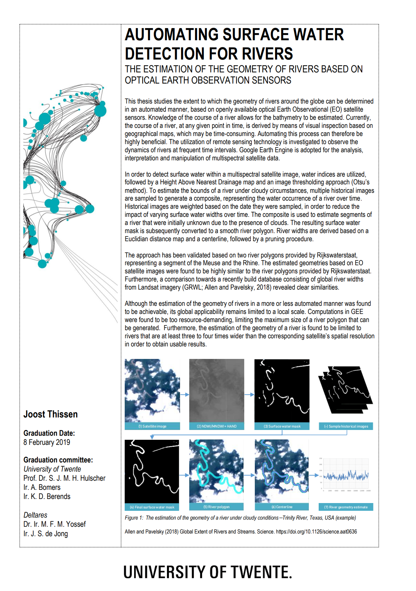
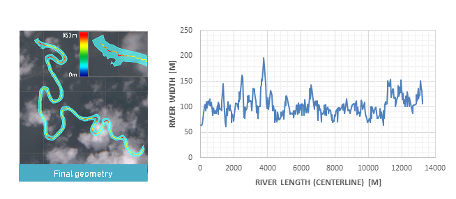
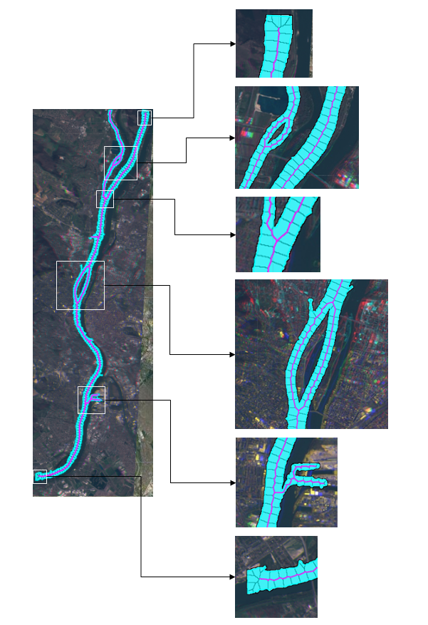

##### February 8, 2019
# MSc thesis: Automating surface water detection for rivers
This repository contains the [source code](https://github.com/JThissen/Automated-surface-water-detection-GEE/tree/master/ThesisScripts) that belongs to my master thesis. 

## Objective
The goal was to study the extent to which the geometry of rivers around the globe can be determined in an automated manner, based on openly available optical Earth Observational (EO) satellite sensors.

## Thesis and summary
The [thesis](https://www.utwente.nl/en/et/wem/education/msc-thesis/2019/thissen.pdf) as well as the [summary](https://www.utwente.nl/en/et/wem/education/msc-summary/2019/thissen.pdf) are published on the University of Twente website.

The source code code may be found in the [thesisscripts](https://github.com/JThissen/Automated-surface-water-detection-GEE/tree/master/ThesisScripts) folder, or directly in the Google Earth Engine Editor: 
* [RiverGeometryEstimate](https://code.earthengine.google.com/de107e51a3401d61adb5ea41169f6144)
* [WaterOccurrenceComposite](https://code.earthengine.google.com/bc112c19943c34c40cbe913df7b2ab45) \
\
...or in my [Google Earth Engine repository](https://earthengine.googlesource.com/users/JThissen/ThesisScripts/) @ *code.earthengine.google.com*.

##### Note that *RiverGeometryEstimate* requires *WaterOccurrenceComposite* to run succesfully.

## Screenshots

